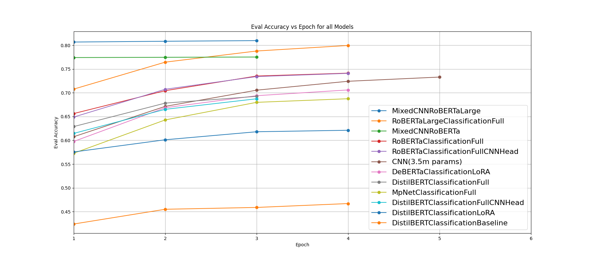
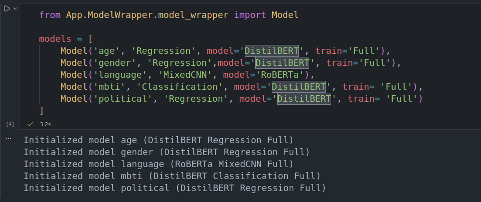

# Native Language Identification with Mixed Architecture

This project focuses on **Native Language Identification** from English text. Its main method is raw **transformer-based encoders**, however in some examples it leverages **Convolutional Neural Networks (CNNs)** alongside **encoder-based models** in a hybrid architecture to capture both local patterns and global contextual features. The system is designed to analyze linguistic traits and writing style, enabling accurate prediction of an author’s native language. It serves as a approachable framework for training, and later, experimenting with fined tuned models on set classification tasks.

---

## Table of Contents

* [Project Structure](#project-structure)
* * [App](#app)
* * [Assets](#assets)
* * [Testing](#testing-shap)
* * [Training](#training)
* * * [Data](#data)
* * * [Models](#models)
* [Usage & Requirements](#usage-requirements)
* [Results / Plots](#results)
* [Screenshots](#screenshots)
* [License](#license)

---
---

## Project Structure

```
.
├── App/                   # How to run it yourself in a Nutshell
│   └── ... 
├── Assets/                # Images, Screenshots, Scripts used to plot data
│   └── ... 
├── Testing/               # Evaluation scripts, notebooks, and test runs of models
│   └── ... 
├── Training/              # Everything related to model training
│   └── ... 
└── README.md
```

---
---

### App

```
App/
├── ModelWrapper/      # Classes for easy loading and running different models
└── RunModels/         # Notebooks that allow you to play around with model predictions
```

* Model Wrappers allows for quick loading of models from the project folders.
* Models have to be firstly trained by running their corresponding training script in their folder.

---
---

### Assets

```
Assets/
├── DataToPlot/         # Scripts with folders to plot data, originally jsons copied from logging training folders
├── Papers/             # Papers used as references when working on the project
├── Plots               # Plots for README
└── Screenshots/        # Screenshots for README
```
* Here we hold various resources needed for presentation and creation of the project

---
---

### Testing & SHAP

```
Testing/
├── comparisons/           # Results of testing ReadyToDeploy HuggingFace models
├── metrics/               # Notebook where you can test Accuracy and F1 of different models
├── runs-legacy/           # Results from previous runs (before finding out optimal ways to do that) per task
└── survey/                # Notebook where you can test models on the data from survey conducted by us during project
```

* SHAP scripts allow per-model testing of actual performance
* SHAP highlights what part of input influenced the output the most which allows diagnostics
* Each subfolder under `runs-legacy/` corresponds to a task like `age`, `gender`, `language`, on other models
* `runs-legacy/` noteooks are LEGACY and **WILL NOT WORK**, they function as a kind of *screenshot docummentation on project work*
* `survey/` contains notebook with data from our collection survey, you can load the models you want and see how they work

---
---

### Training

```
Training/
├── DATA/                       # Raw and preprocessed datasets
└── MODELS/                     # Trained model checkpoints organized by task
```

* Models are organized by task in `Training/MODELS`.
* Different variants are trained for different tasks.
* Each folder contains a `train.py` script responsible for training its model.
* Data is collected and preprocessed in `Training/DATA`.

---

### Models 

```
MODELS/
├── AlternativeDataTest/                 # [MARKED FOR REMOVAL] Temporal folder for testing new datasets 
├── CNN/                                 # Raw CNN on RoBERTa tokenizer embeddings
├── DeBERTaClassificationLoRA/           # LoRA adaptation
├── DistilBERTClassificationBaseline/    # Only final classification layer trained
├── DistilBERTClassificationFull/        # Fully fine-tuned
├── DistilBERTClassificationFullCNNHead/ # Fully fine-tuned standard model with CNN on last layer
├── DistilBERTClassificationLoRA/        # LoRA adaptation
├── MpNetClassificationFull/             # Fully fine-tuned
├── RoBERTaClassificationFull/           # Fully fine-tuned
├── RoBERTaClassificationFullCNNHead/    # Fully fine-tuned standard model with CNN on last layer
├── RoBERTaLargeClassificationFull/      # Fully fine-tuned
├── RoBERTaLargeMixedCNN/                # Parallel running CNN + RoBERTaLarge fully trained, head trained on combined output
└── RoBERTaMixedCNN/                     # Parallel running CNN + RoBERTa fully trained, head trained on combined output
```

---

### Data

```
DATA/
├── NEW                         # Dataset recreated using Lang8 and italki without the unknown origin part from other project repository
│   └── ... 
├── OLD                         # Original Datasets used in the project
│   └── ... 
└── README.md                   # Detailed description of datasets and work regarding them
```

* Stored in `Training/DATA/...` in parquet format.
* Preprocessing scripts in `Training/` handle tokenization, masking, and format conversion.

---
---

## Usage Requirements

* `App/` folder contains the scripts neccesary to train and run recommended models when cloning this repository.
* This code allows users to play around with our project without diving to deep in the technicals.

* Overall system requirements aside from a decent GPU are as follows:
```
Python >= 3.10
PyTorch (torch) with CUDA support
CUDA toolkit
Transformers (Hugging Face)
Pandas
NumPy
scikit-learn
spaCy
SHAP
tqdm
Matplotlib (for plotting)
Jupyter Notebook (optional, for notebooks)
```

---
---

## Results

* Here we present a visual summary of the model evaluation across different tasks. Each plot shows performance metrics (e.g., accuracy, Root Mean Squared Error) for the corresponding task.

| Language Classification|
|------------------------|
||


---
---

## Screenshots [TODO]

* Here we show some screenshots of the working prediction models:

| Screenshots (PLACEHOLDERS FOR NOW)|
|------------------------|
||

---
---

## License

Maybe in the future
